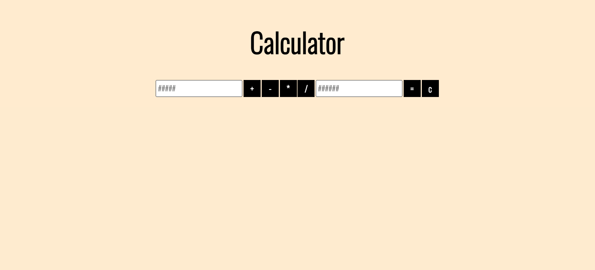
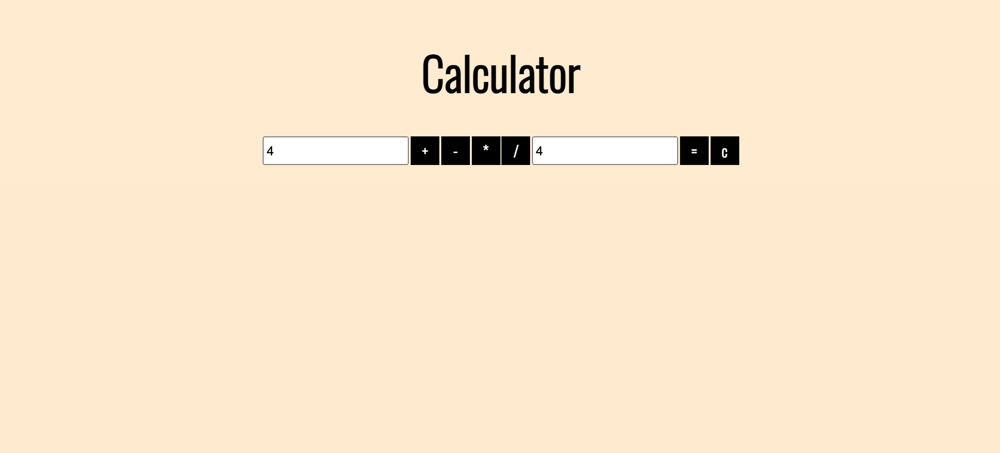
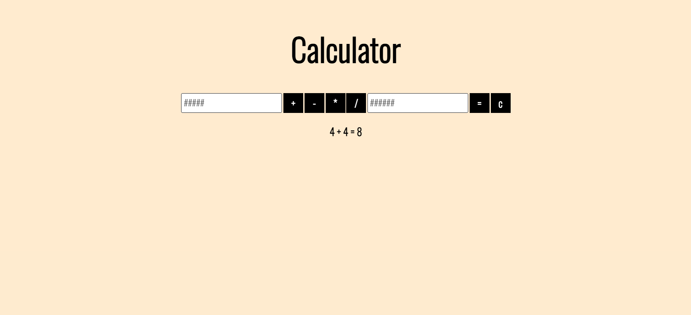

# Pocket Calculator

# Description
## Duration - Weekend Challenge

Welcome to the Pocket Calculator! This is no graphing behemoth you'll find in the basement of Standford, it's (almost) like the one's the bank used to give away for free! You can take two numbers and divide, multiply, add, or substract them! The restults will be logged on your screen, and your whole history will stay logged!

 ## Screen Shots
 Empty Calculator
 
 Calculator with no numbers in the input fields
 
 Display after you hit the '=' key
 

# Prerequisites

 - node.js

 ## Installation

 1. Fork and clone the repo into an easily accessible directory
 1. Open the repo in your IDE
 1. In your terminal, type 'npm start' (this will start your server if node.js is installed)
 1. In your browswer, go to localhost:5000 to find the pocket calculator!
 1. Do all the math you want! You results will be saved in the server until you shut it down
 1. Don't feel embarassed if you don't remember your times tables... nobody does!

 ## Usage

 It's easy to count on our fingers and remember 4x4 (it's 8 right? ...RIGHT?!), but most of us need a little help when it comes to more complicated euqations.

 In the input fields, type numbers, then select your operator! When you click the '=' button, the data will be sent to the server, calculated, and returned to your screen. If you want to clear your input fields, or select a different operator, click the 'c' button to reset the inputs!

 ## Acknowledgement

Huge thanks to the [Prime](https://primeacademy.io/) staff for teaching me the skills to pull this off! It was a grueling week, and I couldn't have made it to the end without their guidance and support!
